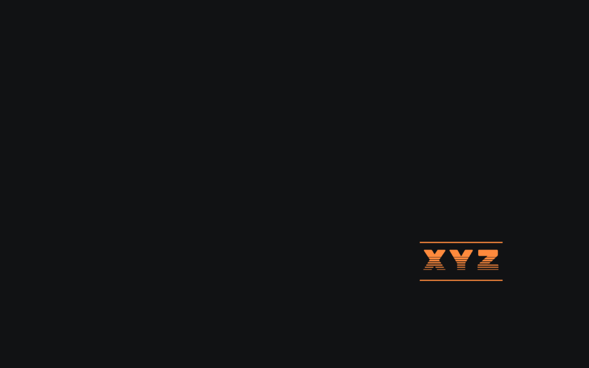
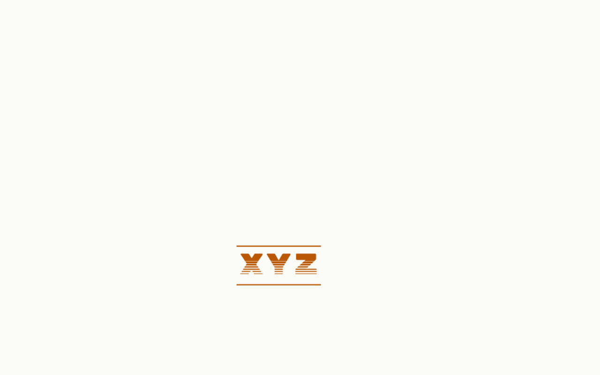
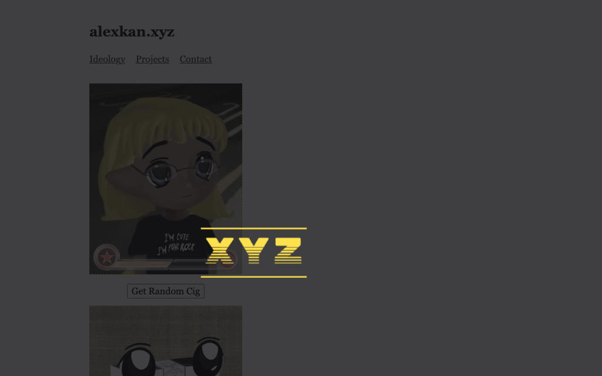
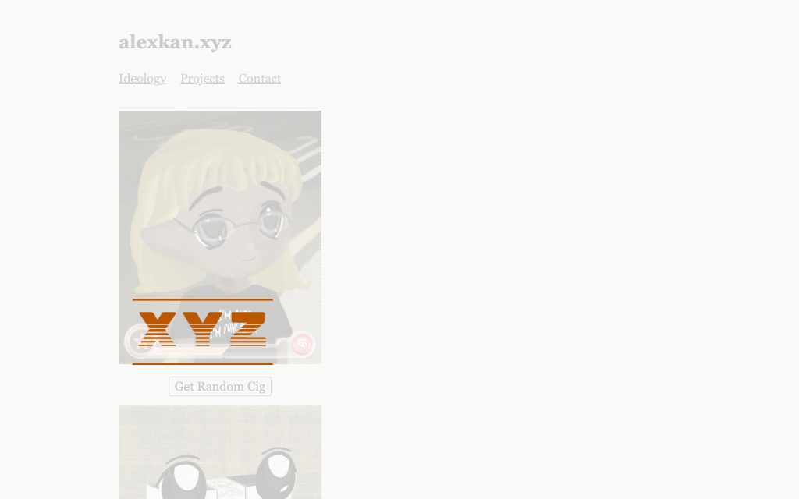
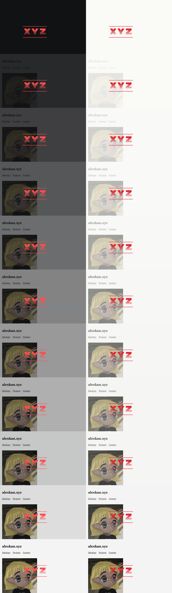
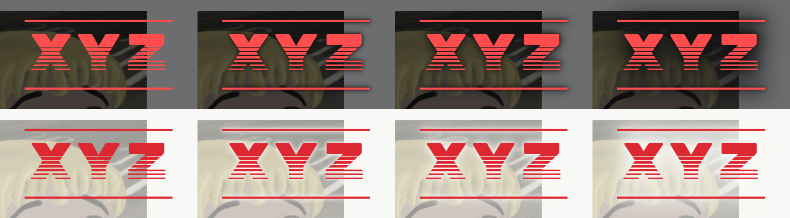
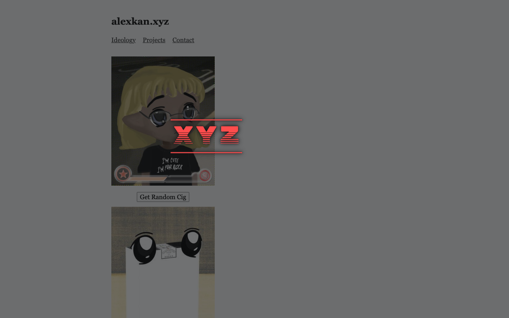
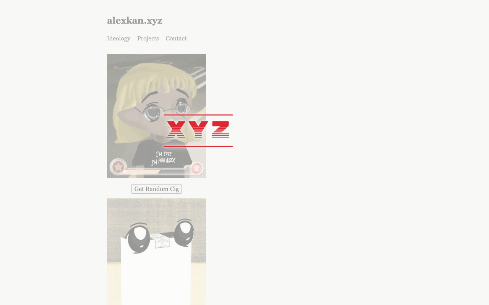
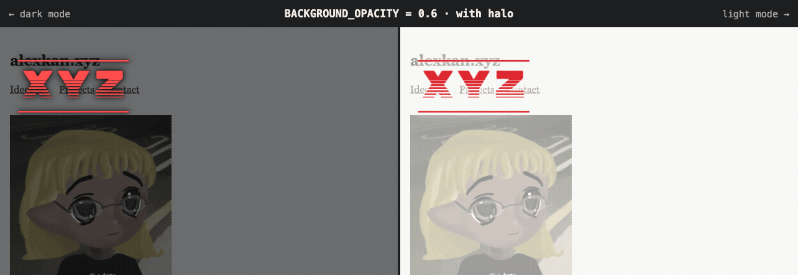

# Screensaver design log

How the idle screensaver in [`public/assets/screensaver.js`](../../public/assets/screensaver.js) got its look: a background at 60% opacity with a soft halo around the logo. Everything here was recorded in headless Chromium against `wrangler dev`, and the GIFs play at real speed. None of it is deployed with the site.

## 1. Solid background

The first version used an opaque `#111214` (dark mode) or `#FAFAF7` (light mode) background with the palettes from [`xyz-logo/README.md`](../../public/assets/xyz-logo/README.md). Every palette color has at least 4.5:1 contrast against its own background.

| Dark mode | Light mode |
|---|---|
|  |  |

## 2. Letting the page show through

A solid background hides which site you're on, so the background got a `BACKGROUND_OPACITY` setting. The first try was 0.8.

| Dark mode | Light mode |
|---|---|
|  |  |

## 3. Every level from 1.0 to 0.0

Each recording starts the logo from the same spot, so the background is the only thing that changes. Rows run from 1.0 at the top to 0.0 at the bottom, with dark mode on the left and light mode on the right.



A five-second clip of each level (`opacity-1.0.gif` to `opacity-0.0.gif`) and one run that steps through all of them (`opacity-sweep.gif`) are in [`artifact/gifs/`](artifact/gifs/).

## 4. Contrast check

The palettes were chosen for the solid backgrounds, so a see-through background costs contrast. This is the lowest contrast the logo gets at each level. The worst case is the red logo, over the light page in dark mode and over the dark parts of the photo in light mode:

| Opacity | Dark mode | Light mode |
|---|---|---|
| 1.0 | 5.7:1 | 4.5:1 |
| 0.9 | 4.5:1 | 3.7:1 |
| 0.8 | 3.2:1 | 3.0:1 |
| 0.7 | 2.3:1 | 2.4:1 |
| 0.6 | 1.6:1 | 1.8:1 |
| 0.5 | 1.2:1 | 1.4:1 |

3:1 is the usual minimum for a graphic to stand out. New palette colors wouldn't fix this: the site itself is always light, so in dark mode a see-through background turns the page gray, and at 0.6 only yellow and cyan clear 3:1 on that gray. The other colors would have to become pastels.

## 5. Halo

Instead of new colors, the logo gets a soft glow in the background color (`LOGO_HALO`), so the letters sit on the background their colors were chosen for, like subtitles over video. These are the strengths tried at 0.6 with the red logo over the photo: from left to right none, thin, medium and strong, with dark mode on top.



Medium, `drop-shadow(0 0 2px) drop-shadow(0 0 6px)` in the background color, was the pick: the thin halo barely helps, and the strong one looks like a smudge. Recordings with and without the halo at 0.7 and 0.6 (`halo-0.7.gif`, `halo-0.6.gif`) are in [`artifact/gifs/`](artifact/gifs/), and close-ups over the photo at twice the resolution are in [`artifact/closeups/`](artifact/closeups/).

## 6. Final: 0.6 with the halo

| Dark mode | Light mode |
|---|---|
|  |  |



## Comparison page

[`artifact/`](artifact/) is a copy of the page used to compare these options, with all of its recordings. To open it, run this from the repo root and go to http://localhost:8000:

```bash
python3 -m http.server -d docs/screensaver/artifact 8000
```
