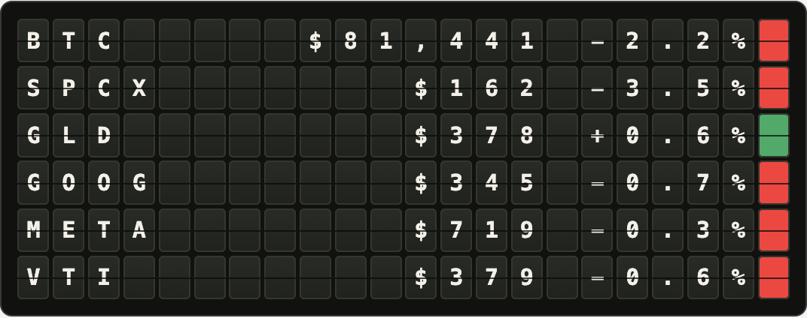

# Alpaca production and staging deployment

The website producer calls Alpaca. The Vesta CLI supports both Yahoo/yfinance
and Alpaca while retaining the Vestaboard SDK for physical-board sends.

The private production producer is `xyz-vesta-refresh`; staging is
`xyz-vesta-refresh-staging`. It reads the Cloudflare
secrets `APCA-API-KEY-ID` and `APCA-API-SECRET-KEY` at runtime and sends them only
to `https://data.alpaca.markets`, with redirects refused. Neither the site
Worker nor browser receives those secrets. The Worker has no public route,
workers.dev URL, preview URL, or HTTP refresh endpoint.

Each scheduled refresh makes two concurrent HTTP requests, without retries:

- One `/v2/stocks/snapshots` request for SPCX, GLD, GOOG, META and VTI,
  explicitly using the free `iex` feed and USD currency. Prices are sampled
  minute-bar closes; percentage changes compare against `prevDailyBar.c`.
  IEX represents one exchange rather than consolidated all-exchange pricing.
- One `/v1beta3/crypto/us/bars` request for `BTC/USD`, using five-minute bars
  and an explicit 20-minute delay. The bounded range includes two prior UTC days, so a delayed bar just
  after midnight still has its correct previous-close comparison. Pagination, missing prior-close bars,
  future timestamps and stale quotes reject the complete snapshot.

Missing symbols or minute bars reject the six-row publication; values are never
fabricated to fill an unsupported ticker. All rows use the existing formatter.
Stocks and Bitcoin have different bar durations, so the Alpaca snapshot's
`priceBasis` is `sampled-bars`. The private KV contract still uses version 1.
The Rust site renderer accepts only the defined provider/basis combinations.

The existing singleton Durable Object, duplicate prevention, atomic snapshot
publication, 1/2/4/8-hour cooldown and CLI-generated demo fallback remain. Alpaca
uses a different named coordinator and `refresh-state:alpaca:v1`; Yahoo's saved
cooldown and history are preserved, not reset. Alpaca's bounded private history
is stored under `vesta:runs:alpaca:v1`. Requests record symbol groups and HTTP
statuses, never authorization headers or provider error bodies.

The 30-minute Cloudflare trigger is restored at minute 17 and 47. The previous
Codex monitoring automation remains paused. Production uses private KV
`1434bc71e28a4c5b90e15f6a57a1078c`; staging uses
`f47f1c49d816470ca5947468c050442c`. Deployments from master update both
the main site and production producer. Only Cloudflare Cron invokes refreshes.

API access does not establish public-display rights. Alpaca's published terms
require notice/permission for making data available to other people. Written
confirmation is recommended for the public personal-site use case.

References:
- https://docs.alpaca.markets/us/reference/stocksnapshots-1
- https://docs.alpaca.markets/us/reference/cryptobars-1
- https://files.alpaca.markets/disclosures/library/TermsAndConditions.pdf

The initial Yahoo Cloudflare experiment completed six scheduled deliveries:
two rate-limited attempts (all four requests HTTP 429) and four cooldown skips,
with zero market snapshots. The CLI-generated Sample Prices board remained
available. Its original `vesta:runs:v1` history and local observations are kept.

## First live verification

Deployed the private producer as version
`fed15d07-337e-44f8-a6aa-018cffc311bc` and updated only the PR 40 site preview
as deployment `f9d9c777-6d62-45cf-8957-63204a18ac7a`.
The first real scheduled refresh was 2026-10-08 18:47:29 UTC (2:47 PM Eastern):
both provider requests returned HTTP 200, all six instruments validated, and
one complete Alpaca market snapshot was published. Bitcoin's sampled price
was $81,373.2545; the board correctly rounded it to $81,373.

The live browser rendered 132 cells in 22 columns, with no Sample Prices
caption or text-view option, and made no provider/API requests. This verifies
one real scheduled publication, not long-term provider reliability.

## Production rollout

Production site version `a150c24e-107c-425b-87fa-f360edc78841` and private
producer version `3d94e28f-ccb3-414b-89a5-fdcaea496074` were deployed October 8.
The production producer has both secret names, its scheduled handler, the
30-minute trigger, and its dedicated KV binding. Its public URL returns 404.
The same production site version is available at
https://a150c24e-xyz.akan72.workers.dev/projects.

The local ISP security filter blocks the custom domain; the deployed production
version was therefore verified through its Cloudflare URL. Writing and Contact
pages still return 200. All 14 method/path checks on the retired price API return
404, and reloading the page makes no provider requests.

The empty production cache was warmed once with the actual staging publication
from 19:17:29 UTC. Both of that scheduled run's batch requests returned 200.
The production HTML matches all 132 cells of this publication, with no Sample
Prices caption or text view. This warm-up made no provider request and did not
modify or fabricate production run history. A production Cron success has not
yet been observed; it is a separate verification from the two successful staging
runs at 18:47 and 19:17 UTC.

