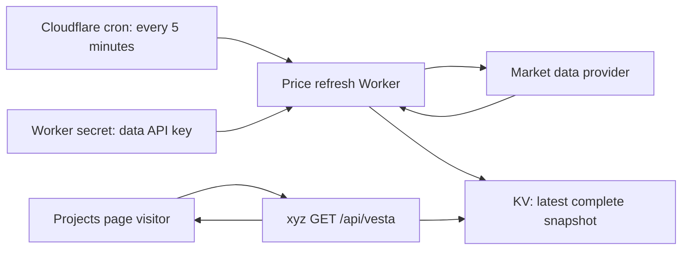
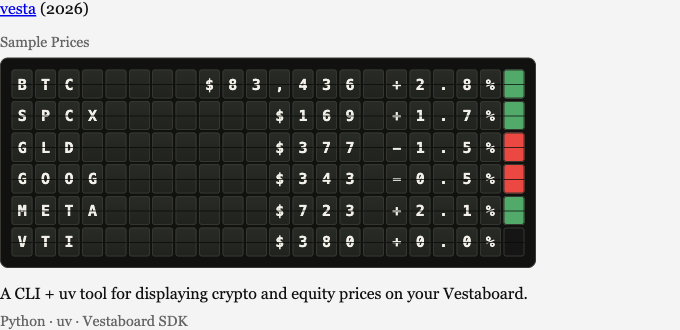
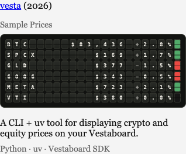
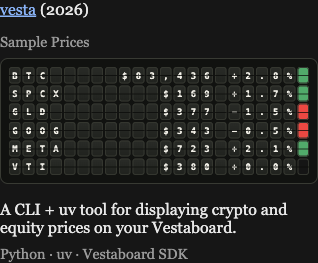

# Vesta on /projects

## Demo shipped now

`site/content/projects/vesta.md` adds Vesta to the projects collection.
`VestaPreview.astro` embeds only the board cells from
`site/generated/vesta-demo.html`, the actual output of Vesta's offline demo.
It adapts the surrounding styles to xyz's project column and theme, without
adding a browser script, fetching prices, or requiring any API key. The
projects page labels the rendering "Sample Prices" and omits the CLI's text view.

The checked-in HTML was generated from Vesta at `0bb2acc`, with
Bitcoin's fixed sample price of $83,436:

```bash
# Run from an updated Vesta checkout with its CLI installed.
vesta --demo --preview-file /absolute/path/to/xyz/site/generated/vesta-demo.html
```

`vesta --demo` alone prints the terminal preview; `--preview-file` produces
the HTML used here. Commit the regenerated file when the demo changes. xyz's
build needs no Python installation or live market-data access.

## Future: refreshed market prices

This is a proposed follow-up, not deployed functionality.



### Provider and price meaning

Start by evaluating Twelve Data's business display offering: it covers US
equities, ETFs, and crypto under one integration. Confirm coverage for all six
instruments and get the required public website display rights and attribution
before subscribing. A key for private use does not automatically authorize a
public projects page. Twelve Data distinguishes internal non-display use from
[external display plans](https://twelvedata.com/pricing-business), and lists
[exchange-specific conditions](https://support.twelvedata.com/en/articles/5332349-commercial-and-personal-usage).
Massive Business is an alternative; its
[display policy](https://massive.com/knowledge-base/article/which-plan-do-i-need-to-show-massive-data-in-my-app)
also requires a business subscription when other people see the data.

Confirm that the display license covers delivery of the small quote snapshot
to the browser as JSON, plus any caching limits. If that delivery requires a
different entitlement, choose an authorized display approach before exposing
the endpoint; CORS does not stop others from downloading a public response.

Request a quote for this small, non-commercial six-symbol display, including
delayed data if it lowers cost. Do not choose a subscription based only on a
personal/free-tier price. Six symbols every five minutes, around the clock,
means 288 refreshes and up to 1,728 symbol credits per day; batching can reduce
HTTP requests without reducing symbol credits. The free 800-credit daily
Twelve Data allowance is insufficient for that schedule.

Use an explicit instrument map. The demo's `BTC` label represents Bitcoin,
with a fixed sample price of $83,436. Map it to the provider's BTC/USD pair,
not a stock/ETF ticker named BTC. Keep provider IDs, display names, asset
types, currencies, and exchanges separate.

For stocks and ETFs, display the most recent eligible trade/price and change
relative to the previous regular-session close; keep both values from the
same feed and adjustment convention. For crypto, define the comparison as
the previous UTC daily close. Record the provider's price timestamp, the
comparison timestamp, currency, feed delay, and market-session state.
Refreshing every five minutes does not make a delayed feed real-time.

### Cloudflare implementation

1. Add a small scheduled refresh Worker, separate from the xyz page-serving
   Worker. Configure a [Cron Trigger](https://developers.cloudflare.com/workers/configuration/cron-triggers/)
   for every five minutes. A cron is UTC; handle the US exchange calendar,
   holidays, and daylight-saving time in the provider/session logic.
2. Store the market-data key in a
   [Worker secret](https://developers.cloudflare.com/workers/configuration/secrets/),
   provisioned with `wrangler secret put MARKET_DATA_API_KEY`. Prefer a key
   limited to market-data reads, with no trading permissions. The refresh
   Worker receives the key; xyz and the browser never need it. Use a
   production key only in the production refresh Worker. PR previews keep
   demo data or isolated staging bindings, and never run the production cron.
3. Fetch only a fixed allowlist of instruments from fixed HTTPS provider
   endpoints. Use timeouts, bounded retries with backoff, and the provider's
   rate-limit guidance. Never accept a visitor-supplied URL, symbol list, or
   refresh command. Do not log credentials, authorization headers, or URLs
   containing keys; emit sanitized status/error codes instead of raw errors.
4. Validate a full snapshot: expected symbols/currencies, finite positive
   prices, usable comparison prices, timestamps, and values that fit the
   board. Normalize it to a small JSON record containing `mode`, `provider`,
   `fetchedAt`, `feedDelaySeconds`, and per-instrument quote/comparison data.
   Write one complete value to KV only after every instrument is valid, so
   readers cannot get a mix of old and new rows. Keep the last successful
   snapshot on timeout, 429, or incomplete data.
5. Bind that namespace to xyz for `GET /api/vesta`. Serve only the sanitized
   cached snapshot with a short public cache lifetime (e.g. 60 seconds), no
   credentials or raw provider responses, and no cross-origin access unless
   needed. All visitors share the scheduled fetches; page traffic cannot
   consume provider credits. An empty store yields an unavailable response,
   not fabricated market prices. [KV is eventually consistent](https://developers.cloudflare.com/kv/concepts/how-kv-works/),
   which is acceptable for a five-minute display; include timestamps because
   a region can briefly see the prior complete snapshot.
6. Fetch that endpoint once when the Vesta preview enters view. Update the
   tiles and text view with text nodes and allowlisted color codes, not
   provider HTML. Mark prices as delayed when applicable, show their last
   update time, and distinguish market-closed data from a failed refresh.
   While loading or unavailable, retain the explicitly labeled demo; do not
   silently present demo prices as market data. For an already visible page,
   an optional five-minute poll can keep it current.

The web integration displays data only. It never stores a Vestaboard key or
sends to the physical board. The CLI keeps using the Vestaboard SDK.

### Before releasing market mode

- Confirm the provider's coverage, public display rights, delay, budget, and
  attribution for the chosen instruments.
- Reuse Vesta's formatter rules through a small documented grid contract or
  a compatible port. Compare against the Python output, especially rounding
  to `0.0%`, negative zero, narrow rows, and oversized prices.
- Verify that inspecting assets, page source, responses, and browser network
  requests reveals no API key; repeated page visits must not cause provider
  fetches. Validate the CI/preview secret boundaries too.
- Exercise missing data, partial batches, 429s, timeouts, weekends, market
  holidays, stale timestamps, and an initially empty KV store.
- Monitor scheduled successes, snapshot age, and quota failures. Rotate keys
  without rebuilding frontend assets. Keep a demo-only rollback path.

## Current verification

`npm run check` and `npm run build` succeeded. The checker reports one existing
unused-variable hint in `404.astro`, with no errors or warnings.
Browser checks confirmed all 132 cells, the six expected color indicators,
the "Sample Prices" caption, no text view, and no horizontal page overflow
at a 390px viewport. Bitcoin's $83,436 price fits the eight-cell price field
within the 22-cell row, including its percentage and color indicator.
The demo was checked in light and dark themes. No market-data API or Vestaboard
send was needed. Automated tests and CI configuration were not added.






