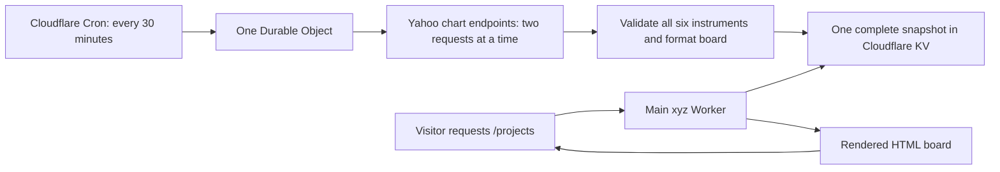

# Vesta prices on /projects

## Architecture

The page keeps the six-row sample board and **Sample Prices** caption as its
initial HTML. That board is generated by the actual Vesta CLI, not a separate
website price table. The project description remains “A CLI + uv tool for displaying
crypto and equity prices on your Vestaboard.” Once enabled, the main site Worker
reads a shared snapshot through its private KV binding and renders the board
into the `/projects` HTML response.



The scheduler and data fetcher are a standard TypeScript Cloudflare Worker.
A small SQLite-backed Durable Object coordinates runs and remembers cooldowns;
it does not stay awake between refreshes. There is no Container or GitHub Actions
scheduler. SQLite Durable Objects are available on the Workers Free plan;
usage is subject to Cloudflare's [current limits and pricing](https://developers.cloudflare.com/durable-objects/platform/pricing/).
The CLI continues using the Vestaboard SDK and Python `yfinance` independently.
The website never sends anything to a physical board.

| Component | Responsibility |
| --- | --- |
| `workers/vesta/worker.ts` | Cron handler, singleton Durable Object, public 404 handler |
| `workers/vesta/prices.ts` | Yahoo fetches, session normalization, durable cooldown, complete KV writes |
| `shared/vesta.ts` | Fixed instruments, snapshot validation, 6×22 board formatting |
| `src/vesta.rs` | Private KV reads, snapshot validation, safe HTML board rendering |
| `site/components/VestaPreview.astro` | CLI-generated sample and marked replacement slots |
| `scripts/update-vesta-demo.mjs` | Regenerate sample HTML by invoking the actual CLI |

## Refresh and data meaning

Cloudflare invokes the producer at minute 17 and 47 of every hour, in UTC.
[Cron Triggers](https://developers.cloudflare.com/workers/configuration/cron-triggers/)
run independently of visits. All deliveries address the same named Durable
Object. Concurrent deliveries share one run, and persisted slot/cooldown state
prevents a duplicate or restarted delivery from making another request burst.
Triggers delayed by a full refresh interval are discarded rather than caught up.

The fixed Yahoo symbols are `BTC-USD,SPCX,GLD,GOOG,META,VTI`. Bitcoin is displayed
as BTC, but the provider query uses BTC-USD; Yahoo's ticker BTC identifies an ETF.
The Worker calls the public Yahoo chart endpoint directly. It uses yfinance's
provider and ticker conventions, not the Python package itself. No market-data
API key, Yahoo account, cookies, or provider subscription is configured.

One refresh fetches five days of five-minute chart bars for each instrument,
with extended hours excluded. The anonymous multiple-symbol quote endpoint
returned HTTP 401 in the local check, so this is a logical batch of six
instruments using six HTTP requests, at most two concurrently. There are no
immediate retries. At the normal 30-minute cadence, the upper bound is 48 rounds
and 288 Yahoo requests per day; an early failure stops subsequent pairs.

Prices come from the latest non-null chart close. These are periodically sampled
chart prices, not a streaming or guaranteed real-time feed. `quotedAt` is the
actual chart point timestamp; `fetchedAt` records when the complete snapshot was
assembled. Percentage change is `(price - previousClose) / previousClose × 100`:

- Securities compare against the last available closing bar from the previous
  regular trading session. Yahoo's session windows handle DST, holidays, and
  shortened sessions without a hardcoded exchange calendar.
- Bitcoin compares against the final five-minute bar before midnight UTC. This
  is a UTC daily comparison, not a rolling 24-hour change.

The five-day response's `chartPreviousClose` refers to the start of that range,
so it is deliberately not used as yesterday's close. Missing comparison bars,
wrong symbols/currencies, nonpositive prices, invalid sessions, future timestamps,
and stale open-market data reject the whole snapshot. Open-market/crypto bars
must be within one hour of fetching; closed security bars may be up to seven
days old. A closed security session must include its final closing bar.

Formatting preserves the CLI's Python float rounding and rejects overflow.
Each row uses six symbol cells, a separator, eight price cells, six percentage
cells, and a RHS color chip. The rounded percentage determines green, red, or
black, including black for a rounded 0.0%. Six-figure Bitcoin prices fit.

## Storage, visitors, and failures

Only after every instrument validates and every row fits does the producer
write one JSON value to `vesta:latest:v1`. No visitor causes a Yahoo request.
The producer has no public HTTP refresh endpoint and accepts no visitor-supplied
symbols. Responses are size-limited, redirects are refused, the refresh has a
45-second fetch deadline, and logs contain fixed result codes rather than
upstream bodies or errors. A private `vesta:runs:v1` history keeps the last 32
Cron deliveries, their scheduled/completed times, per-symbol HTTP statuses, and
the exact snapshot or demo marker successfully published by that delivery.
History is also persisted in the Durable Object. A history-write failure is
logged separately and does not turn a successful price publication into a
failure. Neither history nor snapshot JSON has a public route.

Before fetching, the Durable Object persists a failure lease. Rate limits,
provider errors, invalid responses, or storage failures defer the next attempt
for one hour. A rate limit replaces the displayed snapshot with a demo-mode
marker; other failures preserve the current display. Consecutive failures increase
that delay to two, four, then eight hours, capped at eight. A successful write
resets it to the normal 30-minute schedule. Publishing demo mode does not reset
the failure count or cooldown. The lease also survives a process interruption. A failure after a successful KV write may leave the newer valid
snapshot published while the coordinator remains in cooldown.

The Workers share data through explicit Cloudflare KV bindings. There is no
Worker-to-Worker HTTP endpoint or service-binding proxy to expose. The producer
has no public route, `workers_dev=false`, and `preview_urls=false`; its HTTP
handler always returns 404. Only the main production site Worker and producer
are configured to receive the production KV binding. Cloudflare account
administrators can change these bindings, as with any account-level capability.
See [KV bindings](https://developers.cloudflare.com/kv/concepts/kv-bindings/).

The main site's former `/api/vesta` route and subpaths return 404 for every
method, independently of flags. The browser polling bundle is removed. Visitors
request normal `/projects` HTML; no price JSON, upstream data, or fetch credentials
are embedded in the page. Public visitors can read the displayed prices, but
cannot call the refresh service or its storage directly.

For enabled GET requests to `/projects`, the main Worker reads and validates
the snapshot, then replaces only the marked board slot. The rendering uses
allowlisted Vestaboard characters and three fixed colors, so cached strings or
provider HTML cannot inject markup. The existing CSS wrapper, project description,
other project content, and link-preview tags are preserved. This works with
JavaScript disabled and the site's existing persistent HTML navigation.

The rendered page has a 60-second browser/shared-cache TTL. Incoming static-asset
ETag/Last-Modified validators are removed before fetching the HTML template so
a sample-asset 304 cannot bypass market rendering. Other pages, Markdown copies,
and the generated static `.html` file keep their existing behavior. Prices
refresh on a page load/navigation rather than while a visitor leaves it open;
those visits never change the Yahoo schedule. KV is
[eventually consistent](https://developers.cloudflare.com/kv/concepts/how-kv-works/),
so a newly written snapshot may take time to reach other locations.

Disabled, unbound, empty, unreadable, or malformed storage leaves **Sample
Prices** and the original sample board intact. A valid cached market snapshot
renders without a caption, price metadata, or status text. A Yahoo HTTP 429 or
rate-limit error body writes a versioned demo-mode marker with the fetch time
and reason `rate_limited` to KV, even if market data was previously cached. The main
Worker recognizes this marker and keeps the CLI-generated sample board and
**Sample Prices** caption. There are no demo values in the TypeScript or Rust
Worker. The next successful refresh replaces the marker with market data.
If writing the marker itself fails, the producer logs `demo_fallback_failed`;
it cannot change an existing cached display without a successful KV write. There is no text view
on the projects page and no public JSON endpoint.

## CLI-generated demo source

The fallback artifact is `site/generated/vesta-demo.html`, generated using the
CLI's `DEMO_PRICES`, `format_for_board`, and `write_preview` through its existing
`--demo --preview-file` options. `VestaPreview.astro` extracts only the board
from that output and supplies the site's Sample Prices caption and styles.
Python is used only when regenerating this artifact; the Cloudflare refresh
never runs Python or copies a second demo price table.

Regenerate from a local Vesta checkout after changing the CLI's demo data or
renderer:

```bash
npm run vesta:demo -- /path/to/vesta-checkout
```

The script runs the CLI through uv, with `--frozen` and `--demo --preview-file`,
and validates that there is one 132-cell board,
then replaces the checked-in HTML. Failed CLI generation leaves the prior
artifact intact. Use `VESTA_UV=/path/to/uv` if uv is not on PATH. Normal site
builds use the checked-in output and need no Python environment or market access.
This matches the CLI's preview policy: rate limits switch to its six fixed
sample rows; unrelated fetch failures do not create synthetic market quotes.

## Preview and production activation

The isolated staging namespace is `f47f1c49d816470ca5947468c050442c`.
PR previews read it with `VESTA_LIVE_ENABLED=true`. The private
`xyz-vesta-refresh-staging` producer writes it with its own Durable Object and
`VESTA_REFRESH_ENABLED=true`, on the same 30-minute Cloudflare schedule.
Production remains disabled and has no market-price KV binding. Namespace IDs
are resource identifiers, not credentials.

Deploy the staging producer after changes (the existing site CI deploys the
PR preview separately):

```bash
npx wrangler@4.143.1 deploy --config workers/vesta/wrangler.toml --env staging
```

Authenticated operators can read the private run history with:

```bash
npx wrangler@4.143.1 kv key get vesta:runs:v1 --binding VESTA_PRICES --config workers/vesta/wrangler.toml --env staging --remote
```

Verify successive *scheduled* deliveries, not manual refreshes: each successful
record must have six HTTP 200s and a complete market snapshot. Compare its board
to the live preview's 132 rendered cells after KV/cache propagation. Increasing
quote timestamps demonstrate fresh bars; unchanged rounded cells alone do not
mean the scheduler failed. Rate limits should publish the CLI-generated sample
view and start cooldown, with no catch-up request. A preview without a valid
snapshot keeps Sample Prices. The latest deployment and observations belong in
the PR evidence; the local checks below do not claim Cloudflare reliability.

To stop preview Yahoo traffic, disable the staging producer flag and remove its
Cron Trigger, then redeploy it. The PR cleanup workflow removes the site's PR
preview; it does not remove this separately deployed producer or staging KV.
Stop the producer separately when retiring the experiment.

Production activation remains a separate step:

1. Create a dedicated production KV namespace and bind it as `VESTA_PRICES` in
   both root `wrangler.toml` and `workers/vesta/wrangler.toml`. Use a separate KV
   namespace for staging; never give PR previews the production binding.
2. Set only the producer's production `VESTA_REFRESH_ENABLED` to `true`. Deploy
   the producer separately; Wrangler applies its SQLite Durable Object migration.
   Existing xyz deployment CI does not deploy the separate producer.
3. Observe scheduled runs from actual Cloudflare egress. Confirm all six rows,
   correct Bitcoin identity, session comparisons, result codes, and quote ages.
   An enabled producer writes KV without changing the public site's sample view.
4. Once a valid snapshot is present, enable production `VESTA_LIVE_ENABLED` on
   xyz and deploy the site. Keep PR previews isolated. Verify that
   `/projects` includes the rendered board, `/api/vesta` returns 404 for all
   methods, and browser requests never initiate upstream refreshes.
5. To revert the display, disable the site's live flag; new visits keep the
   sample board. Disable the producer flag as well to stop Yahoo traffic.

The overnight local experiment completed four rounds / 24 requests, all HTTP
200, with zero rate limits or other failures. It missed 12 of its 16 planned
rounds, so it did not validate continuous 30-minute operation. It tested local
machine egress, not Cloudflare. Six additional chart responses captured locally
were used to verify this adapter; no Cloudflare reliability result is claimed.

## Local verification

```bash
npm run check
npm run build
node_modules/.bin/tsc -p workers/vesta/tsconfig.json
cargo fmt --all --check
SDKROOT=/Library/Developer/CommandLineTools/SDKs/MacOSX15.4.sdk cargo check --lib --target wasm32-unknown-unknown
WRANGLER_LOG_PATH=/tmp/vesta-wrangler.log WRANGLER_SEND_METRICS=false npx wrangler@4.143.1 deploy --dry-run --config workers/vesta/wrangler.toml --env="" --outdir /tmp/vesta-yahoo-worker-bundle
python3 -m unittest discover -s scripts -p test_previews.py
git diff --check
```

Temporary offline checks exercise the captured six-symbol responses, two-request
concurrency, session/symbol/currency/time rejection, complete board construction,
duplicate deliveries, rate limits, persisted 1/2/4/8-hour cooldowns, partial and
oversized responses, and storage-failure retention. They make no Yahoo requests.
The local Cloudflare runtime also verified actual SQLite Durable Object RPC
and KV: simultaneous deliveries share one refresh, all six rows are stored,
and duplicate deliveries make no further requests. The server-rendering
checks validate all 132 tiles, fixed colors, caption removal, malformed-storage
fallback, missing template slots, and rejection of unsafe cached characters.
Browser checks use rendered HTML fixtures and confirm no price API request.
Fallback checks cover HTTP/body rate limits after cached market data, demo
selection throughout cooldown, successful recovery, and failed marker writes.
The sample artifact was regenerated through the CLI and matches its six rows
and three green / two red / one black chips.

Astro check/build, TypeScript and Rust compilation, formatting, the Worker
dry-run bundle, and 19 existing preview checks passed. Astro reports one existing
unused-variable hint in `404.astro`. No new CI workflow or committed test suite
is added for this work. The staging producer is deployed; real scheduled-run
evidence is collected separately from these fixture checks.
